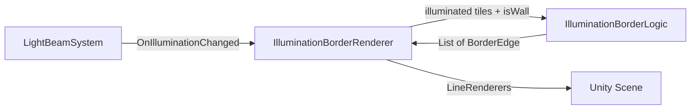

# Design Document: Illumination Border

## Overview

This feature adds a visible red border at the edge of each light source's illumination area. The system follows the existing project architecture: pure computation logic in `Scripts/Core/` and Unity rendering in `Scripts/Components/`. The border is computed by examining each illuminated tile's cardinal neighbors — any edge adjacent to a non-illuminated or wall tile becomes a border edge. These edges are then rendered as red LineRenderer segments in the scene.

## Architecture

The feature consists of two layers:

1. **IlluminationBorderLogic** (pure static class in `Core/`) — computes border edges from a set of illuminated tiles and a wall-check function. No Unity MonoBehaviour dependency, fully testable in EditMode.
2. **IlluminationBorderRenderer** (MonoBehaviour in `Components/`) — subscribes to `LightBeamSystem.OnIlluminationChanged`, calls the logic layer, and renders the resulting edges using Unity `LineRenderer` components.



The border renders at sorting order between `FogSortOrder` (3) and `ElementSortOrder` (4), so it appears above fog but below game objects. A new constant `BorderSortOrder = 3` will be added to `VisualConfig` — since the border is drawn on top of the fog quad but conceptually at the same layer, using the same sort order as fog but rendering after it (due to later creation order) works. Alternatively, we use a dedicated value. We'll use a half-step approach: render at `FogSortOrder` with a slight z-offset to ensure it draws on top of fog.

Actually, since Unity's 2D sorting uses integer sort orders, we'll set `BorderSortOrder = 4` and bump `ElementSortOrder` to 5 and `PlayerSortOrder` to 6. This keeps the border cleanly between fog and elements.

## Components and Interfaces

### IlluminationBorderLogic (Static Class — `Scripts/Core/`)

```csharp
public static class IlluminationBorderLogic
{
    /// Returns all border edges for the given illuminated tile set.
    /// A border edge exists on any cardinal side of an illuminated tile
    /// where the neighbor is not in the illuminated set or is a wall.
    public static List<BorderEdge> ComputeBorderEdges(
        HashSet<Vector2Int> illuminatedTiles,
        Func<Vector2Int, bool> isWall)
    { ... }
}
```

### BorderEdge (Struct — `Scripts/Core/`)

```csharp
public struct BorderEdge : IEquatable<BorderEdge>
{
    public Vector2 Start;  // world-space start point
    public Vector2 End;    // world-space end point

    public BorderEdge(Vector2 start, Vector2 end) { ... }
    
    // Equality: edges are equal regardless of direction (A→B == B→A)
    public bool Equals(BorderEdge other) { ... }
    public override int GetHashCode() { ... }
}
```

### IlluminationBorderRenderer (MonoBehaviour — `Scripts/Components/`)

```csharp
public class IlluminationBorderRenderer : MonoBehaviour
{
    public LightBeamSystem BeamSystem;
    public float BorderWidth = 2f / VisualConfig.SpriteResolution; // 2px in world units
    public Color BorderColor = Color.red;

    // Subscribes to OnIlluminationChanged, calls IlluminationBorderLogic,
    // renders edges using pooled LineRenderers.
}
```

### VisualConfig Updates

```csharp
public const int BorderSortOrder = 4;
public const int ElementSortOrder = 5;  // bumped from 4
public const int PlayerSortOrder = 6;   // bumped from 5
```

## Data Models

### BorderEdge

| Field | Type | Description |
|-------|------|-------------|
| Start | Vector2 | World-space start point of the edge |
| End   | Vector2 | World-space end point of the edge |

Each tile occupies a 1x1 world-space cell centered at `(x+0.5, y+0.5)`. The four cardinal edges of tile `(x, y)` are:

- **Right edge**: `(x+1, y)` → `(x+1, y+1)`
- **Top edge**: `(x, y+1)` → `(x+1, y+1)`
- **Left edge**: `(x, y)` → `(x, y+1)`
- **Bottom edge**: `(x, y)` → `(x+1, y)`

A border edge is emitted for a given side when the neighbor tile in that cardinal direction is either not in the illuminated set or is a wall tile.

### Edge Deduplication

Two adjacent illuminated tiles share an edge. Since we only emit an edge when the neighbor is NOT illuminated, shared edges between two illuminated tiles are naturally excluded — no deduplication is needed. Each edge is emitted exactly once by the illuminated tile that owns it.


## Correctness Properties

*A property is a characteristic or behavior that should hold true across all valid executions of a system — essentially, a formal statement about what the system should do. Properties serve as the bridge between human-readable specifications and machine-verifiable correctness guarantees.*

### Property 1: Border edge correctness and completeness

*For any* set of illuminated tiles and any wall configuration, the list of border edges returned by `IlluminationBorderLogic.ComputeBorderEdges` should contain exactly one edge for every cardinal side of every illuminated tile where the adjacent tile is either not illuminated or is a wall — and no other edges.

In other words: an edge appears in the output if and only if it separates an illuminated tile from a non-illuminated or wall tile.

**Validates: Requirements 1.1, 1.2, 1.3**

### Property 2: Border edge coordinate validity

*For any* set of illuminated tiles, every border edge returned by `IlluminationBorderLogic.ComputeBorderEdges` should have start and end points with integer coordinates, and the edge should be axis-aligned (either horizontal or vertical) with a length of exactly 1 unit.

**Validates: Requirements 1.4**

## Error Handling

| Scenario | Handling |
|----------|----------|
| Null illuminated tile set passed to `ComputeBorderEdges` | Return empty list (treat as empty set) |
| Null `isWall` function passed to `ComputeBorderEdges` | Treat all tiles as non-wall (default to `_ => false`) |
| `IlluminationBorderRenderer` has no `BeamSystem` reference | Log warning, render nothing |
| Level destroyed while border is active | `OnDestroy` cleans up all LineRenderer objects |

## Testing Strategy

### Unit Tests

- Verify that a single illuminated tile with no illuminated neighbors produces exactly 4 border edges.
- Verify that two adjacent illuminated tiles produce 6 border edges (not 8 — the shared edge is excluded).
- Verify that an empty illuminated set produces zero edges.
- Verify that `VisualConfig.FogSortOrder < VisualConfig.BorderSortOrder < VisualConfig.ElementSortOrder`.

### Property-Based Tests

Use FsCheck (already available in the project) with NUnit for property-based testing.

- **Property 1** (Border edge correctness and completeness): Generate random sets of `Vector2Int` tiles and random wall configurations. Compute border edges. Verify that the output contains an edge for every boundary and no edges for non-boundaries.
  - Tag: **Feature: illumination-border, Property 1: Border edge correctness and completeness**
  - Minimum 100 iterations.

- **Property 2** (Border edge coordinate validity): Generate random illuminated tile sets. Compute border edges. Verify every edge has integer coordinates, is axis-aligned, and has length 1.
  - Tag: **Feature: illumination-border, Property 2: Border edge coordinate validity**
  - Minimum 100 iterations.

### Testing Framework

- NUnit with FsCheck for property-based tests
- Assembly: `EditModeTests.asmdef` (references GameScripts, nunit.framework.dll, FsCheck.dll, FSharp.Core.dll)
- Tests go in `LightGame/Assets/Tests/EditMode/`
