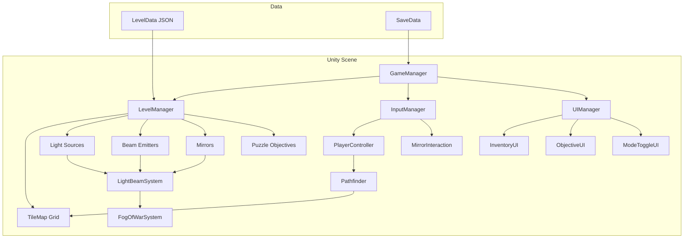

# Design Document: Light Puzzle Game

## Overview

This document describes the technical design for a top-down puzzle game built in Unity targeting Android mobile. The player explores a dark world using light sources and mirrors. Light sources illuminate a circular area and emit directional beams. Mirrors redirect beams around maze-like walls. The player solves puzzles by illuminating all objectives in each level.

The architecture follows Unity's component-based pattern: each game object (player, light source, mirror, tile) is a GameObject with MonoBehaviour scripts attached. This is the standard Unity approach — think of GameObjects as containers and MonoBehaviours as the behaviors you snap onto them.

The game uses a 2D tilemap for the level grid, Unity's built-in pathfinding for tap-to-move, and a custom raycasting system for light beam propagation and reflection.

## Architecture

### High-Level Architecture



### Why This Architecture?

- **GameManager** is a singleton (only one exists) that coordinates everything. It persists across scenes so it can handle level transitions and save/load. In Unity, singletons are a common pattern for manager objects.
- **LevelManager** owns the grid and all objects in a level. When you load a new level, it tears down the old one and builds the new one from JSON data.
- **InputManager** translates raw touch input into game actions. This keeps touch-handling code in one place instead of scattered across scripts.
- **LightBeamSystem** is the core puzzle engine. It traces beams from sources, bounces them off mirrors, and tells the FogOfWarSystem which tiles are lit. This is separate from individual light sources so we can recalculate all beams efficiently when a mirror changes.
- **FogOfWarSystem** manages the dark overlay. It listens to the LightBeamSystem for which tiles are lit and handles the fade-in/fade-out animations.

### Scene Structure

```
Main Scene
├── GameManager (singleton, DontDestroyOnLoad)
│   ├── InputManager
│   └── UIManager
│       ├── Canvas (Screen Space - Overlay)
│       │   ├── InventoryPanel
│       │   ├── ObjectivePanel
│       │   ├── ModeToggleButton
│       │   └── PauseMenu
│
├── LevelRoot (destroyed/recreated per level)
│   ├── Grid (Unity Tilemap)
│   │   ├── WallTilemap
│   │   └── FloorTilemap
│   ├── Player
│   ├── LightSources (parent for all light source objects)
│   ├── BeamEmitters (parent for all beam emitter objects)
│   ├── Mirrors (parent for all mirror objects)
│   ├── PuzzleObjectives (parent for all objective objects)
│   ├── LightBeamSystem
│   └── FogOfWarSystem
│
└── MainCamera
```

## Components and Interfaces

### GameManager

Coordinates game state, level transitions, and save/load.

```csharp
public class GameManager : MonoBehaviour
{
    public static GameManager Instance { get; private set; }
    
    public GameState CurrentState { get; private set; }
    // States: MainMenu, Playing, Paused, LevelComplete, GameComplete
    
    public void LoadLevel(int levelIndex);
    public void PauseGame();
    public void ResumeGame();
    public void OnLevelComplete();
    public void SaveProgress();
    public void LoadProgress();
}
```

**Why a singleton?** The GameManager needs to survive scene transitions (loading new levels). Unity's `DontDestroyOnLoad` keeps it alive. The `Instance` property lets any script access it without needing a reference — e.g., `GameManager.Instance.PauseGame()`.

### InputManager

Translates touch input into game actions. Handles the difference between movement mode and mirror-placement mode.

```csharp
public class InputManager : MonoBehaviour
{
    public InteractionMode CurrentMode { get; private set; }
    // Modes: Movement, MirrorPlacement
    
    public event Action<Vector2Int> OnTileTapped;
    public event Action<Vector2Int> OnTileLongPressed;
    public event Action<float> OnPinchZoom;
    
    public void SetMode(InteractionMode mode);
}
```

**Why events?** Events (C# `Action` delegates) let the InputManager broadcast "a tile was tapped" without knowing who cares. The PlayerController listens in movement mode; MirrorInteraction listens in placement mode. This is the Observer pattern — it keeps InputManager from depending on specific game systems.

### PlayerController

Handles player movement via tap-to-move pathfinding.

```csharp
public class PlayerController : MonoBehaviour
{
    public Vector2Int CurrentTilePosition { get; private set; }
    public float MoveSpeed; // tiles per second, default 5
    
    public void MoveTo(Vector2Int targetTile);
    public bool IsMoving { get; private set; }
    
    public event Action<Vector2Int> OnPlayerMoved;
}
```

### Pathfinder

Simple A* pathfinding on the tile grid. Finds the shortest walkable path between two tiles.

```csharp
public static class Pathfinder
{
    public static List<Vector2Int> FindPath(
        Vector2Int start, 
        Vector2Int end, 
        Func<Vector2Int, bool> isWalkable
    );
}
```

**Why A*?** It's the standard algorithm for grid-based pathfinding. It finds the shortest path efficiently. We pass in an `isWalkable` function so the pathfinder doesn't need to know about the tilemap directly — it just asks "can I walk here?" for each tile.

### LightBeamSystem

The core puzzle engine. Traces all light beams, handles reflections, and reports which tiles are illuminated.

```csharp
public class LightBeamSystem : MonoBehaviour
{
    public int MaxReflections; // default 20
    
    public void RecalculateAllBeams();
    public void RecalculateBeamsFrom(BeamEmitter source);
    public HashSet<Vector2Int> GetIlluminatedTiles();
    public List<BeamSegment> GetBeamSegments(); // for rendering
    
    public event Action<HashSet<Vector2Int>> OnIlluminationChanged;
}

public struct BeamSegment
{
    public Vector2 Start;
    public Vector2 End;
    public Vector2Int Direction;
}
```

**How beam tracing works:**
1. First, determine which beam emitters are active: a beam emitter is active if its tile is within the illumination radius of any light source (with line-of-sight).
2. For each active beam emitter, start at its position heading in its configured direction.
3. Step tile-by-tile in that direction. Mark each floor tile as illuminated.
4. If we hit a wall, stop.
5. If we hit a mirror, calculate the reflection direction based on the mirror's angle, then continue from step 3 in the new direction.
6. If we've reflected more than `MaxReflections` times, stop (prevents infinite loops).
7. Note: beam emitters activated by other beams is NOT supported — only Light_Source radius activates emitters. This keeps the system predictable and avoids complex dependency chains.

### LightSource

An ambient light object that illuminates a circular area. Does not emit directional beams — that's the BeamEmitter's job.

```csharp
public class LightSource : MonoBehaviour
{
    public Vector2Int TilePosition;
    public int IlluminationRadius; // in tiles
    
    public HashSet<Vector2Int> GetRadiusIlluminatedTiles(Func<Vector2Int, bool> isWall);
}
```

**Radius illumination** uses a simple circle check: for each tile within `IlluminationRadius` distance, cast a ray from the source to that tile. If the ray doesn't hit a wall, the tile is illuminated. This is sometimes called "shadow casting" — it creates realistic shadows behind walls.

### BeamEmitter

A directional light object that emits a single Light_Beam, but only when activated by a nearby Light_Source. This is the core puzzle mechanic — players must position light sources to activate beam emitters, then use mirrors to redirect the beams.

```csharp
public class BeamEmitter : MonoBehaviour
{
    public Vector2Int TilePosition;
    public Vector2Int BeamDirection; // one of 8 cardinal/diagonal directions
    public bool IsActive { get; private set; }
    
    public void UpdateActiveState(bool isTileIlluminatedByLightSource);
    
    public event Action OnActiveStateChanged;
}
```

**Why activation matters for puzzles:** Beam emitters are dormant in the dark. The player must first illuminate a beam emitter's tile with a Light_Source's radius before the emitter starts shooting a beam. This creates a two-step puzzle: (1) get light to the emitter, (2) use mirrors to redirect the emitter's beam to the objective. It also means moving a light source can deactivate emitters, adding risk to repositioning.

### Mirror

A reflective object the player can place and rotate.

```csharp
public class Mirror : MonoBehaviour
{
    public Vector2Int TilePosition;
    public int RotationIndex; // 0-7, representing 0° to 315° in 45° steps
    
    public void Rotate(); // increments RotationIndex by 1 (wraps at 8)
    public Vector2Int GetReflectedDirection(Vector2Int incomingDirection);
    
    public event Action OnMirrorChanged;
}
```

**Reflection math:** A mirror at rotation index `r` has a surface normal. When a beam arrives from direction `d`, the reflected direction is calculated using the reflection formula: `reflected = d - 2 * dot(d, normal) * normal`. Since we're on a grid with only 8 directions, the result is always one of the 8 cardinal/diagonal directions. We can precompute a lookup table for all combinations of incoming direction × mirror angle — 8 × 8 = 64 entries.

### MirrorInteraction

Handles mirror pickup, placement, and rotation via touch input.

```csharp
public class MirrorInteraction : MonoBehaviour
{
    public Inventory PlayerInventory;
    
    public bool TryPlaceMirror(Vector2Int tilePosition);
    public bool TryRotateMirror(Vector2Int tilePosition);
    public bool TryPickupMirror(Vector2Int tilePosition);
}
```

### Inventory

Tracks mirrors the player is carrying.

```csharp
public class Inventory : MonoBehaviour
{
    public int MirrorCount { get; private set; }
    
    public void AddMirror();
    public bool RemoveMirror(); // returns false if empty
    
    public event Action<int> OnMirrorCountChanged;
}
```

### FogOfWarSystem

Manages the dark overlay that hides unilluminated areas.

```csharp
public class FogOfWarSystem : MonoBehaviour
{
    public float FadeDuration; // default 0.3 seconds
    
    public void UpdateIllumination(HashSet<Vector2Int> illuminatedTiles);
    public bool IsTileVisible(Vector2Int tile);
}
```

**Implementation approach:** Use a full-screen render texture with one pixel per tile. Black pixels = fog, transparent pixels = visible. When illumination changes, lerp pixel alpha over `FadeDuration`. A shader samples this texture and darkens the game view accordingly. This is GPU-efficient and works well on mobile.

### LevelManager

Loads levels from JSON and instantiates all game objects.

```csharp
public class LevelManager : MonoBehaviour
{
    public LevelData CurrentLevel { get; private set; }
    
    public bool LoadLevel(int levelIndex);
    public bool ValidateLevel(LevelData data);
    public void ClearLevel();
}
```

### CameraController

Follows the player with smooth movement and supports pinch-to-zoom.

```csharp
public class CameraController : MonoBehaviour
{
    public float SmoothSpeed; // lerp factor
    public float MinZoom; // minimum orthographic size
    public float MaxZoom; // maximum orthographic size
    public Bounds LevelBounds;
    
    public void SetTarget(Transform target);
    public void HandlePinchZoom(float zoomDelta);
}
```

### PuzzleObjective

A target that must be illuminated to complete the level.

```csharp
public class PuzzleObjective : MonoBehaviour
{
    public Vector2Int TilePosition;
    public bool IsIlluminated { get; private set; }
    
    public void UpdateIlluminationState(bool illuminated);
    
    public event Action<PuzzleObjective> OnStateChanged;
}
```

## Data Models

### LevelData (JSON)

```json
{
    "levelIndex": 1,
    "width": 10,
    "height": 10,
    "tiles": [
        ["#", "#", "#", "#", "#", "#", "#", "#", "#", "#"],
        ["#", "_", "_", "_", "#", "_", "_", "_", "_", "#"],
        ["#", "_", "#", "_", "#", "_", "#", "#", "_", "#"],
        ["#", "_", "#", "_", "_", "_", "_", "#", "_", "#"],
        ["#", "_", "#", "#", "#", "#", "_", "#", "_", "#"],
        ["#", "_", "_", "_", "_", "#", "_", "_", "_", "#"],
        ["#", "#", "#", "#", "_", "#", "#", "#", "_", "#"],
        ["#", "_", "_", "_", "_", "_", "_", "_", "_", "#"],
        ["#", "_", "#", "#", "#", "#", "_", "#", "_", "#"],
        ["#", "#", "#", "#", "#", "#", "#", "#", "#", "#"]
    ],
    "playerStart": { "x": 1, "y": 1 },
    "lightSources": [
        { "x": 1, "y": 1, "radius": 3 },
        { "x": 7, "y": 7, "radius": 2 }
    ],
    "beamEmitters": [
        { "x": 3, "y": 3, "beamDirection": { "x": 1, "y": 0 } },
        { "x": 7, "y": 7, "beamDirection": { "x": 0, "y": -1 } }
    ],
    "mirrors": [
        { "x": 6, "y": 3, "rotationIndex": 6 },
        { "x": 4, "y": 7, "rotationIndex": 2 }
    ],
    "puzzleObjectives": [
        { "x": 8, "y": 1 },
        { "x": 1, "y": 7 }
    ]
}
```

- `tiles`: 2D array where `"_"` = floor, `"#"` = wall
- `lightSources`: Ambient lights with a circular radius (no beam direction)
- `beamEmitters`: Directional beam sources with a direction vector; only active when illuminated by a Light_Source
- `beamDirection`: one of the 8 unit directions (e.g., `{1,0}` = right, `{0,1}` = up, `{1,1}` = diagonal)
- `rotationIndex`: 0-7 mapping to 0°-315° in 45° steps

### SaveData

```json
{
    "currentLevelIndex": 3,
    "completedLevels": [0, 1, 2]
}
```

### Enums and Constants

```csharp
public enum GameState
{
    MainMenu,
    Playing,
    Paused,
    LevelComplete,
    GameComplete
}

public enum InteractionMode
{
    Movement,
    MirrorPlacement
}

public static class GridDirections
{
    public static readonly Vector2Int Up = new(0, 1);
    public static readonly Vector2Int Down = new(0, -1);
    public static readonly Vector2Int Left = new(-1, 0);
    public static readonly Vector2Int Right = new(1, 0);
    public static readonly Vector2Int UpLeft = new(-1, 1);
    public static readonly Vector2Int UpRight = new(1, 1);
    public static readonly Vector2Int DownLeft = new(-1, -1);
    public static readonly Vector2Int DownRight = new(1, -1);
    
    public static readonly Vector2Int[] All = { Up, Down, Left, Right, UpLeft, UpRight, DownLeft, DownRight };
}
```

### Reflection Lookup Table

Rather than computing reflection math at runtime, we precompute all 64 combinations (8 incoming directions × 8 mirror angles). This is stored as a 2D array:

```csharp
// reflectionTable[incomingDirectionIndex][mirrorRotationIndex] = outgoingDirectionIndex
// Indices 0-7 map to: Right, UpRight, Up, UpLeft, Left, DownLeft, Down, DownRight
```

This makes reflection instant — just a table lookup — which matters when recalculating beams on every mirror change.


## Correctness Properties

*A property is a characteristic or behavior that should hold true across all valid executions of a system — essentially, a formal statement about what the system should do. Properties serve as the bridge between human-readable specifications and machine-verifiable correctness guarantees.*

The following properties were derived from the acceptance criteria in the requirements document. Each property is universally quantified ("for all" / "for any") and references the specific requirements it validates.

### Property 1: Pathfinding correctness

*For any* grid of wall and floor tiles, and any two floor tiles A and B, `FindPath(A, B)` should return either the shortest path consisting only of walkable (floor) tiles, or an empty list if no path exists. Every tile in the returned path must be a floor tile, and consecutive tiles must be adjacent.

**Validates: Requirements 1.1, 1.2**

### Property 2: Radius illumination with shadow casting

*For any* light source at position P with radius R on any grid, a floor tile T within distance R of P is in the illuminated set if and only if there is an unobstructed line-of-sight from P to T (no wall tiles blocking the ray). Wall tiles are never in the illuminated set.

**Validates: Requirements 2.1, 2.2**

### Property 3: Fog-illumination invariant

*For any* game state with any combination of light sources, beam emitters, and light beams, the set of tiles visible through the fog of war must equal exactly the union of all tiles illuminated by light source radii and light beam paths. No tile should be visible without illumination, and no illuminated tile should be hidden.

**Validates: Requirements 2.3, 2.4, 3.4, 5.1, 5.5**

### Property 4: Beam tracing correctness

*For any* grid with active beam emitters and mirrors, tracing a beam from an active beam emitter should produce a sequence of beam segments where: (a) each segment is a straight line in one of the 8 grid directions, (b) each segment starts at a beam emitter or mirror and ends at a wall or mirror, (c) floor tiles along each segment are marked as illuminated, and (d) at each mirror, the outgoing direction matches the reflection of the incoming direction. Dormant (inactive) beam emitters must produce no beam segments.

**Validates: Requirements 3.1, 3.2, 3.4, 8.3**

### Property 5: Beam emitter activation

*For any* beam emitter and any set of light sources on a grid, the beam emitter is active if and only if its tile position is within the illumination radius of at least one light source with unobstructed line-of-sight. A beam emitter not illuminated by any light source must remain dormant and emit no beam.

**Validates: Requirements 3.1, 3.2, 3.3**

### Property 6: Mirror reflection correctness

*For any* incoming beam direction (one of 8 grid directions) and any mirror rotation angle (one of 8 rotation indices), the reflected direction must satisfy the law of reflection: the angle of incidence relative to the mirror's surface normal equals the angle of reflection. The reflected direction must also be one of the 8 valid grid directions.

**Validates: Requirements 3.3, 8.2**

### Property 7: Inventory round-trip

*For any* sequence of mirror pickup and placement operations, the inventory mirror count must equal the number of pickups minus the number of successful placements. Picking up a placed mirror and then placing it again should leave the inventory count unchanged (round-trip).

**Validates: Requirements 4.1, 4.2, 4.4**

### Property 8: Mirror rotation invariant

*For any* mirror, after any number of rotation operations, the rotation index must be in the range [0, 7]. Each rotation increments the index by 1 with wraparound: `(currentIndex + 1) % 8`. Rotating 8 times returns the mirror to its original angle.

**Validates: Requirements 4.3, 8.1**

### Property 9: Level data serialization round-trip

*For any* valid LevelData object, serializing it to JSON and deserializing the JSON back should produce a LevelData object equivalent to the original. All fields (tiles, player start, light sources, beam emitters, mirrors, puzzle objectives) must be preserved.

**Validates: Requirements 7.3**

### Property 10: Level validation correctness

*For any* LevelData object, the validation function should accept it if and only if: (a) all tile values are `"_"` (floor) or `"#"` (wall), (b) there is at least one beam emitter, (c) there is at least one puzzle objective, (d) the player start position is on a floor tile, and (e) all object positions are within grid bounds and on floor tiles. Invalid data must be rejected.

**Validates: Requirements 6.1, 7.1, 7.2, 7.4**

### Property 11: Beam reflection loop cap

*For any* grid configuration where mirrors create a reflection loop (beam reflects back toward a previous mirror), the beam tracing system must terminate with at most 20 beam segments (reflections). The system must never enter an infinite loop regardless of mirror placement.

**Validates: Requirements 8.5**

### Property 12: Camera bounds clamping

*For any* player position and level bounds, the computed camera position must be clamped so the camera viewport stays within the level boundaries. *For any* zoom input, the resulting orthographic size must be clamped between the configured minimum and maximum values.

**Validates: Requirements 9.3, 9.4**

### Property 13: Level completion check

*For any* set of puzzle objectives and any set of illuminated tiles, the level is complete if and only if every puzzle objective's tile position is in the illuminated set. Partial illumination (some but not all objectives lit) must not trigger completion.

**Validates: Requirements 6.2**

### Property 14: Remaining objectives count

*For any* set of puzzle objectives and any set of illuminated tiles, the remaining objectives count must equal the number of objectives whose tile position is not in the illuminated set. This count must be non-negative and at most equal to the total number of objectives.

**Validates: Requirements 10.2**

### Property 15: Save/load round-trip

*For any* valid game state (current level index, completed levels list), saving the state and then loading it back should produce an equivalent game state. The current level index and completed levels list must be preserved exactly.

**Validates: Requirements 11.4**

## Error Handling

### Level Loading Errors

- **Invalid JSON**: If a level file contains malformed JSON, the LevelManager catches the parse exception, logs the error, and returns the player to the level selection screen with an error message.
- **Validation failure**: If a level passes JSON parsing but fails validation (see Property 9), the LevelManager displays a specific error message indicating what's missing (e.g., "Level has no light sources") and returns to level selection.
- **Missing level file**: If the requested level index has no corresponding file, the GameManager treats it as game-complete (all available levels finished).

### Beam Tracing Errors

- **Infinite reflection loop**: Handled by the 20-reflection cap (Property 10). The beam simply stops after 20 reflections. No error is displayed to the player — the beam just ends.
- **Invalid mirror angle**: If a mirror somehow has a rotation index outside 0-7, clamp it to the valid range before computing reflection.

### Pathfinding Errors

- **No path exists**: If the player taps a tile with no walkable path, `FindPath` returns an empty list. The InputManager shows brief visual feedback (a red flash on the tapped tile) and the player stays put.
- **Path blocked during movement**: If the path becomes blocked while the player is moving (e.g., a mirror is placed on the path), the player stops at the last reachable tile.

### Save/Load Errors

- **Corrupted save data**: If save data fails to deserialize, the game starts fresh from level 1. A brief message informs the player that save data could not be loaded.
- **Save failure**: If saving fails (e.g., storage full), log the error. The game continues normally — the player just won't have their progress saved for that session.

### Touch Input Edge Cases

- **Multi-touch conflicts**: Only the first touch point is used for game interactions. Additional simultaneous touches are ignored except for pinch-to-zoom (which requires exactly two touch points).
- **Rapid tapping**: Debounce mirror rotation to prevent accidental double-rotations. Minimum 200ms between rotation actions on the same mirror.

## Testing Strategy

### Dual Testing Approach

This game uses both unit tests and property-based tests for comprehensive coverage:

- **Unit tests**: Verify specific examples, edge cases, and error conditions. Good for testing known level configurations, specific mirror angles, and error handling paths.
- **Property-based tests**: Verify universal properties across randomly generated inputs. Good for testing that pathfinding, beam tracing, reflection, and serialization work correctly for all possible inputs, not just hand-picked examples.

Both are complementary — unit tests catch concrete bugs in known scenarios, property tests discover unexpected edge cases through randomization.

### Property-Based Testing Library

Use **FsCheck** with NUnit for Unity. FsCheck is a mature property-based testing library for .NET/C# that integrates well with Unity's test runner.

- NuGet package: `FsCheck` and `FsCheck.NUnit`
- Each property test runs a minimum of 100 iterations
- Custom generators will be needed for: grid layouts, tile positions, mirror configurations, beam directions

### Test Tag Format

Each property-based test must include a comment referencing its design property:

```csharp
// Feature: light-puzzle-game, Property 1: Pathfinding correctness
```

### Test Organization

```
Assets/
└── Tests/
    ├── EditMode/
    │   ├── PathfinderTests.cs          // Unit + Property tests for A* pathfinding
    │   ├── LightBeamSystemTests.cs     // Unit + Property tests for beam tracing
    │   ├── MirrorReflectionTests.cs    // Unit + Property tests for reflection math
    │   ├── LevelDataTests.cs           // Unit + Property tests for serialization & validation
    │   ├── InventoryTests.cs           // Unit + Property tests for inventory management
    │   ├── CameraTests.cs             // Unit + Property tests for camera clamping
    │   ├── FogOfWarTests.cs           // Unit + Property tests for fog invariant
    │   └── PuzzleObjectiveTests.cs    // Unit + Property tests for completion logic
    └── PlayMode/
        └── IntegrationTests.cs         // Play-mode tests for component integration
```

### Custom Generators

Property-based tests need random input generators:

- **GridGenerator**: Produces random grids of configurable size with walls and floors. Ensures at least one connected floor region.
- **TilePositionGenerator**: Produces random floor tile positions within a given grid.
- **MirrorConfigGenerator**: Produces mirrors with random positions (on floor tiles) and random rotation indices (0-7).
- **DirectionGenerator**: Produces one of the 8 valid grid directions.
- **LevelDataGenerator**: Produces complete valid LevelData objects with random but valid configurations.

### Property-to-Test Mapping

| Property | Test File | Type |
|----------|-----------|------|
| P1: Pathfinding correctness | PathfinderTests.cs | Property |
| P2: Radius illumination | LightBeamSystemTests.cs | Property |
| P3: Fog-illumination invariant | FogOfWarTests.cs | Property |
| P4: Beam tracing correctness | LightBeamSystemTests.cs | Property |
| P5: Beam emitter activation | LightBeamSystemTests.cs | Property |
| P6: Mirror reflection correctness | MirrorReflectionTests.cs | Property |
| P7: Inventory round-trip | InventoryTests.cs | Property |
| P8: Mirror rotation invariant | MirrorReflectionTests.cs | Property |
| P9: Level data round-trip | LevelDataTests.cs | Property |
| P10: Level validation | LevelDataTests.cs | Property |
| P11: Beam reflection loop cap | LightBeamSystemTests.cs | Property |
| P12: Camera bounds clamping | CameraTests.cs | Property |
| P13: Level completion check | PuzzleObjectiveTests.cs | Property |
| P14: Remaining objectives count | PuzzleObjectiveTests.cs | Property |
| P15: Save/load round-trip | LevelDataTests.cs | Property |
