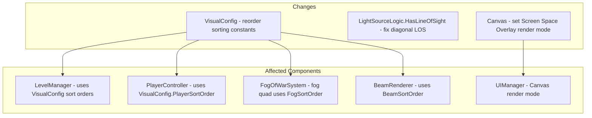

# Design Document: Visual Bug Fixes

## Overview

This design addresses three visual bugs in the Light Puzzle Game discovered after the visual-update spec:

1. **Sprite clipping by fog overlay**: Element sprites (player, light source) are visually clipped because the fog overlay renders at sorting order 10, above elements (order 3) and the player (order 4). On illuminated tiles the fog is transparent, but the high sorting order still causes visual artifacts at tile boundaries where adjacent tiles are fogged.

2. **Illumination gap above light source**: The Bresenham line-of-sight algorithm in `LightSourceLogic.HasLineOfSight` has a subtle bug where diagonal steps can skip intermediate tile checks, potentially causing tiles that should be illuminated to appear dark. Additionally, the algorithm's behavior on axis-aligned paths needs verification for correctness.

3. **UI hidden behind fog**: The UI Canvas is rendered behind the fog overlay, making inventory, objectives, mode toggle, and menu panels invisible or obscured during gameplay.

### Root Cause Analysis

**Bug 1 — Sorting Order**:
The current sorting order hierarchy is: Floor(0) < Wall(1) < Beam(2) < Element(3) < Player(4) < Fog(10). The fog overlay renders above all game elements. While the fog shader uses alpha blending (alpha=0 on illuminated tiles makes fog transparent), the high sorting order means the fog quad is drawn on top of element sprites. At tile boundaries between illuminated and fogged tiles, the fog's opaque black pixels visually clip element sprites that are positioned near the edge of their tile. The fix is to move the fog sorting order below elements and the player: Floor(0) < Wall(1) < Beam(2) < Fog(3) < Element(4) < Player(5). This ensures elements always render on top of the fog, and the fog still correctly obscures floor/wall tiles.

**Bug 2 — Bresenham LOS**:
The `HasLineOfSight` method uses a standard Bresenham line algorithm. When both the x-step and y-step conditions fire simultaneously, the algorithm takes a diagonal step, moving both x and y in one iteration. This means it checks the destination of the diagonal step but skips checking the two tiles it "passed through" (the horizontal-adjacent and vertical-adjacent tiles). For line-of-sight in a grid game, a diagonal step should be blocked if either of the two adjacent tiles is a wall — otherwise light "leaks" through diagonal wall gaps. The fix is to check both cardinal neighbors when a diagonal step occurs and block LOS if either is a wall.

**Bug 3 — UI behind fog**:
The UI Canvas is likely using "Screen Space - Camera" render mode, which means it participates in the same sorting order system as scene sprites. Since the fog overlay was at sorting order 10, and the Canvas sorting order was lower, the fog covered the UI. The fix is to set the Canvas render mode to "Screen Space - Overlay", which renders the UI on top of all scene content regardless of sorting orders. This is the standard approach for game HUD elements.

## Architecture



### Updated Sorting Order

| Layer | Old Order | New Order | Elements |
|-------|-----------|-----------|----------|
| Floor | 0 | 0 | Floor tiles |
| Wall | 1 | 1 | Wall tiles |
| Beam | 2 | 2 | Light beam LineRenderers |
| Fog | 10 | 3 | Fog of war overlay |
| Element | 3 | 4 | Light sources, beam emitters, mirrors, objectives |
| Player | 4 | 5 | Player sprite |

## Components and Interfaces

### VisualConfig Changes (`Scripts/Core/VisualConfig.cs`)

Update the sorting order constants to place fog below elements and player:

```csharp
public static class VisualConfig
{
    // Scale factors — unchanged
    public const float PlayerScale = 0.5f;
    public const float LightSourceScale = 0.5f;
    public const float BeamEmitterScale = 0.5f;
    public const float MirrorScale = 0.5f;
    public const float ObjectiveScale = 0.5f;

    // Sorting orders — fog moved below elements
    public const int FloorSortOrder = 0;
    public const int WallSortOrder = 1;
    public const int BeamSortOrder = 2;
    public const int FogSortOrder = 3;       // was 10
    public const int ElementSortOrder = 4;   // was 3
    public const int PlayerSortOrder = 5;    // was 4

    public const int SpriteResolution = 32;
    public const float BeamWidth = 0.1f;
}
```

No interface changes. All consumers already reference these constants by name.

### LightSourceLogic.HasLineOfSight Fix (`Scripts/Core/LightSourceLogic.cs`)

The fix adds wall checks for both cardinal neighbors when a diagonal step occurs. When the Bresenham algorithm steps both x and y simultaneously, the two intermediate tiles (horizontal-step-only and vertical-step-only) must both be checked. If either is a wall, LOS is blocked — light cannot pass diagonally between two walls.

```csharp
public static bool HasLineOfSight(Vector2Int source, Vector2Int target, Func<Vector2Int, bool> isWall)
{
    int x0 = source.x, y0 = source.y;
    int x1 = target.x, y1 = target.y;

    int dx = Math.Abs(x1 - x0);
    int dy = Math.Abs(y1 - y0);
    int sx = x0 < x1 ? 1 : -1;
    int sy = y0 < y1 ? 1 : -1;
    int err = dx - dy;

    while (true)
    {
        if (x0 == x1 && y0 == y1)
            return true;

        int e2 = 2 * err;
        bool stepX = e2 > -dy;
        bool stepY = e2 < dx;

        // Diagonal step: check both cardinal neighbors
        if (stepX && stepY)
        {
            var hNeighbor = new Vector2Int(x0 + sx, y0);
            var vNeighbor = new Vector2Int(x0, y0 + sy);
            if (isWall(hNeighbor) && isWall(vNeighbor))
                return false;
        }

        if (stepX)
        {
            err -= dy;
            x0 += sx;
        }
        if (stepY)
        {
            err += dx;
            y0 += sy;
        }

        if (x0 == x1 && y0 == y1)
            return true;

        if (isWall(new Vector2Int(x0, y0)))
            return false;
    }
}
```

Key change: when both `stepX` and `stepY` are true (diagonal move), check the horizontal neighbor `(x0+sx, y0)` and vertical neighbor `(x0, y0+sy)`. If both are walls, LOS is blocked — light cannot squeeze through a diagonal wall gap.

## Data Models

No new data models. The changes are limited to constant values in `VisualConfig`, algorithm logic in `LightSourceLogic`, and Canvas render mode configuration.

### Canvas Render Mode Change

The UI Canvas must be set to `RenderMode.ScreenSpaceOverlay`. This is a scene-level change on the Canvas GameObject. If the Canvas render mode is set in code (e.g., during initialization), add:

```csharp
canvas.renderMode = RenderMode.ScreenSpaceOverlay;
```

If it's only set in the Inspector, the scene file must be updated. Since this is a scene configuration change, it cannot be fully validated in EditMode tests, but we can add a runtime check or document the required Inspector change.


## Correctness Properties

*A property is a characteristic or behavior that should hold true across all valid executions of a system — essentially, a formal statement about what the system should do. Properties serve as the bridge between human-readable specifications and machine-verifiable correctness guarantees.*

### Property 1: Sorting order hierarchy is strictly ascending with fog below elements

*For any* pair of adjacent layers in the ordering (Floor, Wall, Beam, Fog, Element, Player), the lower-priority layer shall have a strictly smaller sorting order value than the higher-priority layer. Specifically: FloorSortOrder < WallSortOrder < BeamSortOrder < FogSortOrder < ElementSortOrder < PlayerSortOrder.

**Validates: Requirements 1.4, 1.5, 1.6**

### Property 2: All unobstructed floor tiles within radius are illuminated

*For any* randomly generated grid with walls, a light source position on a floor tile, and a radius, every floor tile within the radius that has a clear line-of-sight from the light source (no wall on the Bresenham path) shall be present in the illuminated tile set returned by `GetRadiusIlluminatedTiles`.

**Validates: Requirements 2.1, 2.2, 2.3**

### Property 3: Diagonal wall gaps block line-of-sight

*For any* source tile and target tile where the Bresenham path requires a diagonal step, if both cardinal neighbors at the diagonal step (the horizontal-adjacent and vertical-adjacent tiles) are walls, then `HasLineOfSight` shall return false. Light cannot pass through a diagonal gap between two walls.

**Validates: Requirements 2.4**

### Property 4: Illumination is symmetric

*For any* grid, light source position, and radius, if tile at offset (dx, dy) from the light source is illuminated, then the tile at offset (-dx, -dy) shall also be illuminated when the wall configuration is mirrored correspondingly (i.e., on a wall-symmetric grid, the illuminated set is symmetric around the light source).

**Validates: Requirements 2.5**

## Error Handling

| Scenario | Handling |
|----------|----------|
| Fog quad in scene still has old sorting order | The sorting order is set via `VisualConfig.FogSortOrder` constant. If the fog quad's sorting order is hardcoded in the scene, it must be updated to reference the constant or be set to 3. |
| Existing tests reference old sorting order values | Tests that assert specific sorting order numbers (e.g., `FogSortOrder == 10`) must be updated to match the new values. |
| Bresenham LOS fix changes illumination results | Existing property tests for LightSourceLogic already validate that illuminated tiles have LOS and are within radius. The fix should pass all existing tests. If any existing test fails, it indicates the test was relying on the buggy behavior. |
| Canvas render mode changed breaks UI layout | Screen Space - Overlay uses screen coordinates. If UI elements were positioned using world-space coordinates, they may need repositioning. Standard anchored UI layouts should work without changes. |

## Testing Strategy

### Testing Framework

- **Unit tests**: NUnit (configured in `EditModeTests.asmdef`)
- **Property-based tests**: FsCheck (available via `FsCheck.dll` in Plugins)
- Tests run in Unity Editor Test Runner (EditMode tab), not via command line

### Dual Testing Approach

**Unit tests** cover:
- Specific level_0 scenario: light at (1,1) radius 3, verify tiles (1,2), (1,3), (1,4) are illuminated
- Diagonal wall gap example: two walls at (2,1) and (1,2), verify LOS from (1,1) to (2,2) is blocked
- Sorting order values match expected new hierarchy

**Property-based tests** cover:
- Property 1: Sorting order strict ascending chain (deterministic, but validates the invariant)
- Property 2: Reuse existing `LightGridArbitrary` generator — for all generated grids, every unobstructed floor tile within radius is illuminated (existing test, validates fix doesn't regress)
- Property 3: Generate grids with diagonal wall gaps, verify LOS is blocked
- Property 4: Generate symmetric grids, verify illumination symmetry

### Property-Based Testing Configuration

- Library: FsCheck with NUnit integration
- Minimum 100 iterations per property test
- Each test tagged with: **Feature: visual-bug-fixes, Property {N}: {title}**
- Each correctness property implemented as a single property-based test
- Test file: `LightGame/Assets/Tests/EditMode/VisualBugFixTests.cs`
- Reuse `LightGridArbitrary` from `LightSourceLogicTests.cs` for grid generation
