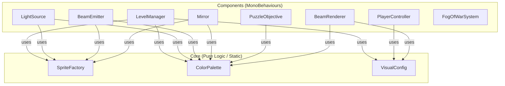

# Design Document: Visual Update

## Overview

This design covers the visual overhaul of the Light Puzzle Game. The game currently uses placeholder sprites (default Unity squares/circles) and the player is oversized relative to the tile grid. The update introduces:

- A `SpriteFactory` static class that programmatically generates all sprites at runtime (no external assets)
- A `ColorPalette` static class centralizing all color definitions for a dark, atmospheric theme
- A `VisualConfig` static class defining scale factors and sorting orders
- Component-level changes to apply proper visuals to each game element during level load

The approach keeps pure data/logic in `Scripts/Core/` and MonoBehaviour integration in `Scripts/Components/`, consistent with the existing architecture.

## Architecture



### Rendering Layer Order

All sorting orders are defined in `VisualConfig` and follow this ascending priority:

| Layer | Sorting Order | Elements |
|-------|--------------|----------|
| Floor | 0 | Floor tiles |
| Walls | 1 | Wall tiles |
| Beams | 2 | Light beam LineRenderers |
| Game Elements | 3 | Light sources, beam emitters, mirrors, puzzle objectives |
| Player | 4 | Player sprite |
| Fog Overlay | 10 | Fog of war quad |

## Components and Interfaces

### SpriteFactory (Static Class — `Scripts/Core/SpriteFactory.cs`)

Generates Texture2D and Sprite assets programmatically. All methods are pure functions (same inputs → same outputs).

```csharp
public static class SpriteFactory
{
    // Generates a filled circle sprite with the given color and pixel resolution
    public static Sprite CreateCircle(int resolution, Color color);

    // Generates a filled diamond/rhombus sprite
    public static Sprite CreateDiamond(int resolution, Color color);

    // Generates a filled directional triangle sprite (points right by default)
    public static Sprite CreateTriangle(int resolution, Color color);

    // Generates a filled rectangle sprite (width x height pixels)
    public static Sprite CreateRectangle(int width, int height, Color color);

    // Generates a filled square sprite
    public static Sprite CreateSquare(int resolution, Color color);
}
```

Each method:
1. Creates a `Texture2D` of the specified resolution
2. Fills pixels according to the shape geometry
3. Calls `texture.Apply()`
4. Returns `Sprite.Create(texture, ...)` with a centered pivot

### ColorPalette (Static Class — `Scripts/Core/ColorPalette.cs`)

Centralizes all color constants. Uses a dark theme where background colors have HSV Value < 0.4.

```csharp
public static class ColorPalette
{
    public static readonly Color Wall;              // Dark blue-gray, e.g. #1a1a2e
    public static readonly Color Floor;             // Very dark gray, e.g. #0f0f1a
    public static readonly Color Player;            // Soft cyan/teal, e.g. #4ecdc4
    public static readonly Color LightSource;       // Warm amber, e.g. #f9a825
    public static readonly Color BeamEmitter;       // Orange-red, e.g. #ff6f00
    public static readonly Color MirrorSurface;     // Silver/light gray, e.g. #b0bec5
    public static readonly Color ObjectiveUnlit;    // Dim purple, e.g. #4a148c with low alpha
    public static readonly Color ObjectiveLit;      // Bright gold, e.g. #ffd600
    public static readonly Color Beam;              // Warm yellow glow, e.g. #fff59d
    public static readonly Color Fog;               // Pure black with alpha
}
```

### VisualConfig (Static Class — `Scripts/Core/VisualConfig.cs`)

Centralizes scale factors and sorting orders.

```csharp
public static class VisualConfig
{
    // Scale factors (relative to 1 Unity unit tile)
    public const float PlayerScale = 0.5f;
    public const float LightSourceScale = 0.5f;
    public const float BeamEmitterScale = 0.5f;
    public const float MirrorScale = 0.5f;
    public const float ObjectiveScale = 0.5f;

    // Sorting orders
    public const int FloorSortOrder = 0;
    public const int WallSortOrder = 1;
    public const int BeamSortOrder = 2;
    public const int ElementSortOrder = 3;
    public const int PlayerSortOrder = 4;
    public const int FogSortOrder = 10;

    // Sprite resolution (pixels per tile)
    public const int SpriteResolution = 32;

    // Beam rendering
    public const float BeamWidth = 0.1f;
}
```

### Component Changes

#### PlayerController Changes
- On `Initialize()`, set `transform.localScale` to `Vector3.one * VisualConfig.PlayerScale`
- Add a `SpriteRenderer` with a circle sprite from `SpriteFactory`, colored with `ColorPalette.Player`
- Set sorting order to `VisualConfig.PlayerSortOrder`

#### LevelManager Changes
- When creating game objects, attach `SpriteRenderer` components with appropriate sprites and colors
- For wall tiles: create tile GameObjects with square sprites, `ColorPalette.Wall`, sorting order `VisualConfig.WallSortOrder`
- For floor tiles: create tile GameObjects with square sprites, `ColorPalette.Floor`, sorting order `VisualConfig.FloorSortOrder`
- For light sources: attach circle sprite, `ColorPalette.LightSource`, scale `VisualConfig.LightSourceScale`
- For beam emitters: attach triangle sprite, `ColorPalette.BeamEmitter`, scale `VisualConfig.BeamEmitterScale`, rotate to match direction
- For mirrors: attach rectangle sprite, `ColorPalette.MirrorSurface`, scale `VisualConfig.MirrorScale`, rotate to match `RotationIndex`
- For puzzle objectives: attach diamond sprite, `ColorPalette.ObjectiveUnlit`, scale `VisualConfig.ObjectiveScale`

#### Mirror Changes
- In `Rotate()`, update `transform.rotation` to `Quaternion.Euler(0, 0, -RotationIndex * 45f)`

#### PuzzleObjective Changes
- Update `UpdateIlluminationState()` to use `ColorPalette.ObjectiveUnlit` / `ColorPalette.ObjectiveLit`
- Set alpha to 0.25 when unlit, 0.85 when lit

#### BeamRenderer Changes
- Use `ColorPalette.Beam` for beam color
- Use `VisualConfig.BeamWidth` for line width
- Set sorting order to `VisualConfig.BeamSortOrder`

## Data Models

### No new data models are introduced.

The visual update operates entirely through configuration constants (`ColorPalette`, `VisualConfig`) and runtime sprite generation (`SpriteFactory`). The existing `LevelData`, `GameState`, and component data models remain unchanged.

### Configuration Data (Static Constants)

| Constant | Type | Value | Purpose |
|----------|------|-------|---------|
| `PlayerScale` | float | 0.5 | Player size relative to tile |
| `SpriteResolution` | int | 32 | Pixel resolution for generated sprites |
| `BeamWidth` | float | 0.1 | Beam line width in Unity units |
| Sorting orders | int | 0–10 | Render layer priority |


## Correctness Properties

*A property is a characteristic or behavior that should hold true across all valid executions of a system — essentially, a formal statement about what the system should do. Properties serve as the bridge between human-readable specifications and machine-verifiable correctness guarantees.*

### Property 1: Player position is tile-centered

*For any* valid tile position (x, y) on the grid, after the player is initialized or arrives at that tile, the player's world position shall equal (x + 0.5, y + 0.5, 0), which is the center of the tile.

**Validates: Requirements 1.2**

### Property 2: Beam emitter rotation matches direction

*For any* beam direction vector from the set of 8 grid directions, the visual rotation angle applied to the beam emitter sprite shall equal `Atan2(direction.y, direction.x)` converted to degrees, so the triangle points in the emission direction.

**Validates: Requirements 4.2**

### Property 3: Mirror visual rotation matches rotation index

*For any* rotation index in [0, 7], the visual Z-rotation of the mirror sprite shall equal `-(rotationIndex * 45)` degrees. This must hold both at initial placement and after any number of `Rotate()` calls.

**Validates: Requirements 5.2, 5.3**

### Property 4: Dark theme brightness constraint

*For any* color in the set {ColorPalette.Wall, ColorPalette.Floor}, converting to HSV shall yield a Value (brightness) channel strictly below 0.4.

**Validates: Requirements 8.3**

### Property 5: Sprite factory determinism

*For any* valid resolution in [1, 128] and any color, calling the same SpriteFactory method twice with identical parameters shall produce textures with identical pixel data.

**Validates: Requirements 9.3**

### Property 6: Sprite factory produces non-empty textures

*For any* valid resolution in [1, 128] and any color with alpha > 0, generating a sprite and reading back its pixel data shall contain at least one non-transparent pixel.

**Validates: Requirements 9.4**

### Property 7: Sorting orders are strictly ascending

*For any* pair of visual layers (floor, wall, beam, element, player, fog), the layer with higher visual priority shall have a strictly greater sorting order value. Specifically: Floor < Wall < Beam < Element < Player < Fog.

**Validates: Requirements 10.1**

## Error Handling

| Scenario | Handling |
|----------|----------|
| `SpriteFactory` called with resolution ≤ 0 | Return a 1x1 fallback sprite with the requested color. Log a warning. |
| `SpriteFactory` called with resolution > 512 | Clamp to 512 to prevent excessive memory use. Log a warning. |
| `Shader.Find("Sprites/Default")` returns null | Fall back to a basic unlit material. Log an error. |
| `SpriteRenderer` missing on a game object | Add one via `AddComponent<SpriteRenderer>()` during setup. |
| Color palette color is accidentally transparent (alpha = 0) | Each color constant is defined with alpha = 1.0 by default. No runtime check needed — this is a compile-time guarantee. |

## Testing Strategy

### Testing Framework

- **Unit tests**: NUnit (already configured in `EditModeTests.asmdef`)
- **Property-based tests**: FsCheck (already available in the project)
- Tests run in Unity Editor via the Test Runner window (not command line)

### Dual Testing Approach

**Unit tests** cover:
- Each `SpriteFactory` method produces a non-null sprite with correct dimensions
- `ColorPalette` constants are all defined and non-default
- Scale factor constants are within specified ranges (0.4–0.6)
- Objective alpha values meet bounds (unlit ≤ 0.3, lit ≥ 0.7)
- Wall and floor colors are visually distinct

**Property-based tests** cover:
- Property 1: Player centering — generate random tile positions, verify world position
- Property 2: Beam emitter rotation — generate all 8 directions, verify angle
- Property 3: Mirror rotation — generate random rotation indices, verify angle
- Property 4: Dark theme — verify HSV brightness for background colors
- Property 5: Sprite determinism — generate random resolutions and colors, verify identical output
- Property 6: Sprite non-empty — generate random resolutions and colors, verify non-transparent pixels
- Property 7: Sorting order — verify strict ascending order across all layers

### Property-Based Testing Configuration

- Library: FsCheck with NUnit integration
- Minimum iterations: 100 per property test
- Each test tagged with: **Feature: visual-update, Property {N}: {title}**
- Each correctness property implemented as a single property-based test
- Test file: `LightGame/Assets/Tests/EditMode/VisualUpdateTests.cs`
